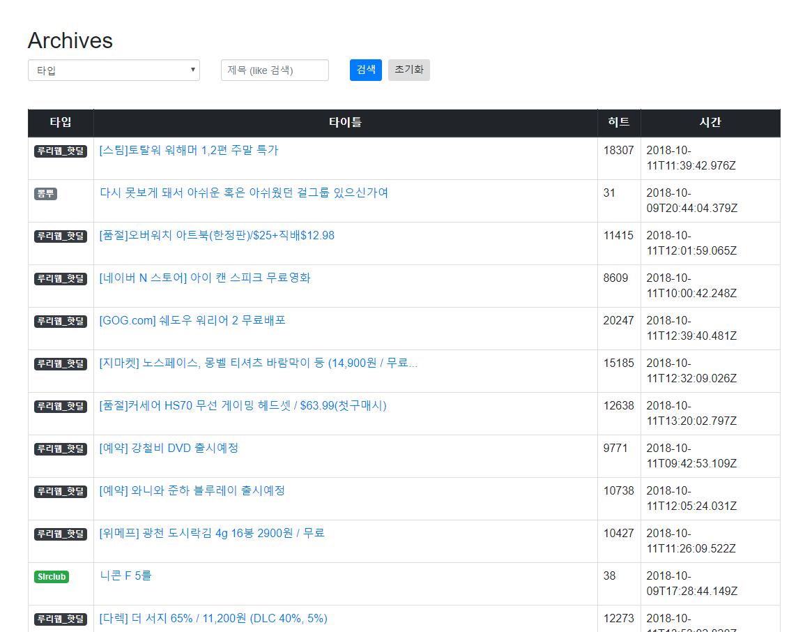

[](https://elky84.github.io)


## Community Board
MongoDB를 읽고, 크롤링된 정보를 게시판으로 보여주는 Frontend 서비스입니다.

```
$ npm install
$ npm run dev
```

이 프로젝트는 <https://github.com/elky84/community_crawler> 프로젝트에서 크롤링한 정보를 바탕으로 동작합니다.

local에 설치된 mongodb를 바탕으로 동작하므로, 해당 설정 정보를 수정하셔야 합니다.


